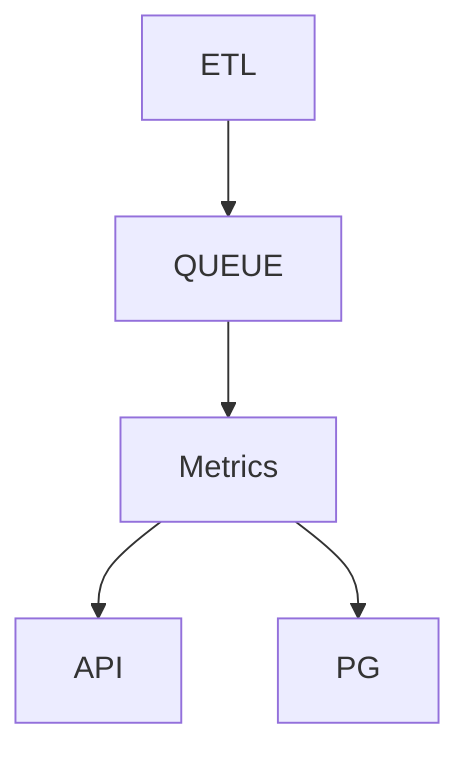
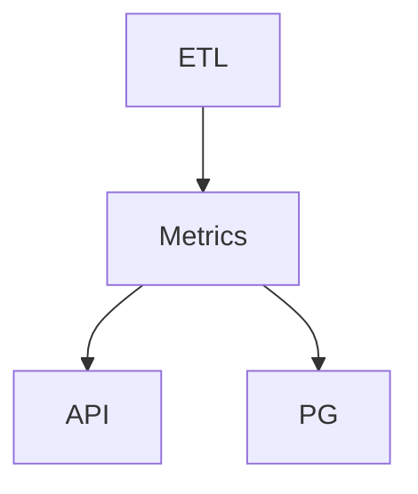

# Small metrics server for AI model stats

Wanted infra


What's implemented here, since I wanted the thing to run locally and in minikube locally.



## Assumptions
* I focused on stats metrics ingestion, storage and delivery.
* I wanted a solution that could run in minikube to show the dataflow from one end to the other. 
* ETL should likely be done with proper tools, here it's simply a script that is run on schedule (once a minute) as a Kubernetes Cronjob.
* Ingest into a queue, to offload API performance and thread hogging. I didn't want to introduce an external queue at this point, but that would likely be done in production.
* The exact workings and format of the monitoring queue can be refined to suite any dashboard etc
* The alerting was done as a very minimal solution, my instinct says it could be a separate service that consumes the queue as well. 


What is included?
* HTTP API to handle incoming metric events
* HTTP API to get stats with some filters support. Response format is pretty raw and could be refined. 
* Alerting on stats criteria
* Stored in Postgres
* Deploy in Kubernetes (Minikube, not tested in a real cluster)

Alerting is done in log, but a Dashboard or a Slack integration or similar would be optimal. 
Example alert
```
ALERT prediction_accuracy lower than 0.3, {'name': 'Mistral', 'version': 'v1', 'prediction_accuracy': 0.19342903578218118, 'drift': 0.11206803927678188, 'inference_time': 12.757847941304057}
```

Scaling thoughts:
* Scaling out the API with multiple kubernetes pod instances should be fine, but the queue should probably be moved out to a real queue like Google Cloud Pub/sub.
* Moving the queue out would open for a better batching process where the subscriber could take a chunk of events and process them.
* The Postgres database would be a bottleneck at some point, perhaps sharding and deleting old shards could help.


## Running on minikube
```
> minikube start
> eval $(minikube docker-env)
> docker build . -t api:v1 -f Dockerfile-api
> docker build . -t etl:v1 -f Dockerfile-etl
> kubectl apply -f k8s/pipeline.yaml
```
check pods, the api pod will be in error at first since the DB pod needs to start, but it will retry successfully after a few seconds

To access api:
```
> kubectl port-forward svc/modelapi 8080:80
> curl http://localhost:8080/stats/Llama/v1
```


## Running locally
Create the venv and install requirements.pip
```
> python3 -m venv path/to/repo/venv
> source path/to/repo/venv/bin/activate
> python3 -m pip install -r requirements.pip
```

Run postgres with docker
```
> docker run --rm --name pg17-stats -e POSTGRES_USER=stats -e POSTGRES_PASSWORD=foobar -e POSTGRES_DB=stats -d -p 5433:5432 arm64v8/postgres:17.5
```

```
> fastapi dev main.py
```

Run the etl a few times to get data
```
> python3 ETL.py
```

Filter stats by name and version, e.g.
```
> curl -v http://localhost:8000/stats/Llama/v1
```
